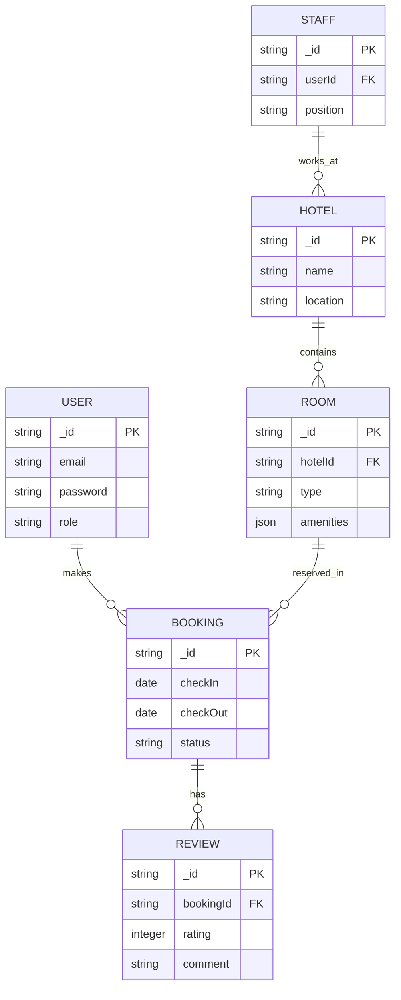

# 🏨 Hotel Management System

A full-stack hotel booking system with dynamic pricing, role-based access control, and comprehensive room/service management.


## 📌 Overview
**Hotel Management System** is a full-featured web application that simulates a real-world hotel booking experience similar to platforms like **Booking.com**. It allows users to:
- Search and book rooms with available services (Wi-Fi, Sauna, etc.).
- Modify their booking dates.
- Submit reviews about the hotel and its services after checkout.
- View dynamic room pricing based on the current season (summer, winter, etc.).
- Explore different user roles (Admin, Staff, Customer) with dynamic access control.

---

## 🌟 Features

### 1. Booking Management
- Room reservation with date selection
- Booking modification/cancellation
- Multiple room types (Standard, Deluxe, Suite)
- Seasonal pricing (summer/winter/holiday rates)
- Service add-ons (WiFi, Sauna, Breakfast, etc.)

### 2. User System
- **Authentication & Authorization**
  - JWT-based security
  - Dynamic role management
- **Three Profile Types**
  - Guest profiles (booking users)
  - Staff profiles (hotel employees)
  - Hotel profiles (property management)

### 3. Admin Dashboard
- Room inventory management
- Staff management
- Pricing configuration
- Booking analytics

### 4. Technical Architecture
- Clean layered architecture:
  - DTOs ↔ Controllers ↔ Services ↔ Repositories ↔ Entities
- Centralized error handling
- Transaction safety middleware
- API documentation (Swagger/OpenAPI)

### 5.🏨 Room Booking System
- Book available rooms and select optional services.
- Modify or cancel booking dates.
- Automatic room availability updates.

### 6.🧾 Room Services
Each room can include:
- Free or paid Wi-Fi.
- Sauna.
- Room service.
- Additional customizable amenities.

### 7.💸 Seasonal Pricing System
- Room pricing is dynamically calculated based on the current **season/weather**.
- Example: Higher prices in **summer**, lower in **winter**.

### 8.👥 Profiles
- **User Profile:** View and manage personal bookings and reviews.
- **Staff Profile:** Hotel employees can manage room services and booking requests.
- **Hotel Profile:** Hotel overview, services, reviews, and room status.

### 9.📝 Review System
- Users can review their **stay experience** and rate hotel services after checkout.

---

## 🧪 Architecture & Code Practices

- **Clean Architecture:** Clear separation of concerns using:
  - `DTOs` (Data Transfer Objects)
  - `Entities`
  - `Repositories`
  - `Services`
  - `Controllers`
- **Middleware:** Centralized error handling and transaction safety.
- **Scalable Design:** Easy to extend with new features or services.

---

## 🛠️ Tech Stack

### Backend
- Node.js / Express
- MongoDB (or PostgreSQL)
- TypeScript
- JWT Authentication
- Redis (for caching)

### Frontend (if applicable)
- React.js / Next.js
- Tailwind CSS
- Redux Toolkit

## 🗄️ Database Schema (Key Entities)


## 🚀 Getting Started
### Clone the repository 

```
git clone https://github.com/Mero0077/Hotel-Management.git
cd Hotel-Management
```

### 📚 API Endpoints (Sample)

| Method | Endpoint               | Description          | Access        |
| ------ | ---------------------- | -------------------- | ------------- |
| POST   | `/api/auth/register`   | User registration    | Public        |
| POST   | `/api/auth/login`      | User login           | Public        |
| GET    | `/api/rooms`           | List available rooms | Public        |
| POST   | `/api/bookings`        | Create new booking   | Authenticated |
| PUT    | `/api/bookings/:id`    | Modify booking       | Owner/Admin   |
| GET    | `/api/staff/dashboard` | Staff dashboard      | Staff         |
| POST   | `/api/admin/pricing`   | Set seasonal pricing | Admin         |


## 📝 Dynamic Role System
Roles hierarchy:

Guest – Basic booking access

Staff – Hotel operations

Receptionist

Housekeeping

Manager

Admin – Full system control

### 💳 Dynamic Pricing Model

- Pricing factors:
- Base room rate
- Seasonal multiplier (e.g., summer +20%, winter +15%)
- Demand-based adjustments
- Special offers

Example calculation:

```
// Winter rate for Deluxe room
basePrice = 150;
seasonMultiplier = 1.15;
finalPrice = basePrice * seasonMultiplier; // $172.50
```
### 🤝 Contributing
Pull requests are welcome! For major changes, please open an issue first.

### 📄 License
MIT
